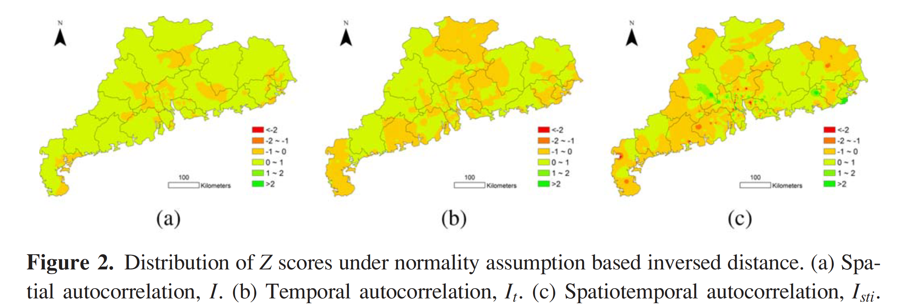

<!-- _class: lead -->
<!-- _backgroundImage: url('https://i.pinimg.com/736x/9a/32/f7/9a32f7530dd5f70b32d89b0f7381e372.jpg') -->
 
## Spatio-temporal Clustering for Geographic Events <!-- fit -->
#### Prepared by Evgeny Noi
--- 

<!-- paginate: true -->

# Spatial Moran's 

$I = \frac{n \sum \sum w_{ij}(a_i - \bar{a})(a_j-\bar{a})}{\sum \sum w_{ij}(a_i - \bar{a})(a_j-\bar{a})}$

where $w_{ij}$ is a spatial weight matrix of 0/1. 

$I_i = \frac{z_i \sum_j w_{ij}z_j}{\delta^2}$

where $\delta^2$ is variance of $a$ and $z_i = (a_i - \bar{a})$.

---

# Extensions to *time* 

* Assume stationarity 
* Empirical estimations based on data
* In Betazzon (2003) solved a set of 8 equations, where coefficients were set up as matrices in matrices
* Joining spatial and temporal matrices into one (multiplicative)
* Subject to scaling effects 

---

# Difficulties in implementing *space-time* autocorrelation

* Integrating different units in space and time 
* how the different levels of non-stationarity in spatial data and in temporal data may exist
* spatial and temporal trends of geographical events may not be symmetrical or always be separable

--- 

# Typical *space-time* representation

* Binary matrices based on threshhold (0/1)
* Inverse of distance ($1/d_{ij}, 1/t_{ij}$)

---

# Alternatives: clustering

* Non-parametric spatio-temporal clustering (aka *Scan statistic*). Iterative in nature - repetitive computations. 

---

# Global and Local Temporal Moran's $I$

$I_t = \frac{n \sum \sum w_{ij} (t_i - \bar{t})(t_j - \bar{t})}{W \sum (t_i - \bar{t})(t_j - \bar{t})}$

$I_{ti} = u_i \sum w_{ij} u_i$

where $u_i = \frac{(t_i - \bar{t})}{\delta_t^2}$

---

# Spatio-Temporal Moran's $I$ 

$I_{st} = \frac{n \sum \sum w_{ij} t_{ij}(a_i - \bar{a})(a_j - \bar{a})}{\sum \sum w_{ij} t_{ij}(a_i - \bar{a})(a_j - \bar{a})}$

where $t_{ij} = \bigg | \frac{1}{t_i - t_j} \bigg |$, and is binary depending on the threshold

$I_{sti} = \frac{z_i \sum v_{ij} z_i}{\delta^2}$

--- 

# Assumptions 

* Normality - the attribute value of each geographic event is considered to be drawn from a normal distribution (as well as timing)
* Randomization - equally likely random permutation of $n$ events (Getis & Ord, 1981)

---

## Microblogs autocorrelation (normality)

---

## 7 days temporal window

--- 

## 14 days temporal window 

--- 

## Microblogs autocorrelation (randomization)

--- 

# Conclusions

* Different results under normality and randomization
* Multiplicative nature of geographic events 
* Time dimension alone cannot explain spatial autocorrelation (temporal effects in geo phenomena are not constant over space)

--- 

# Critiques 

* The authors assessed st autocorrelation on point pattern data only, but not on areal data (which might yeild different results, especially for different contiguity metrics) 
* *spatio-temporal* autocorrelation is only significant for $1/d_{ij}$ and not for binary threshholded variables. Otherwise there could be **too many** zeroes. 

--- 

# Questions? :cocktail: <!-- fit -->

--- 

<!-- _class: lead -->
<!-- paginate: false -->
<!-- backgroundImage: white -->

# Evgeny Noi 

> Make Geography Great Again